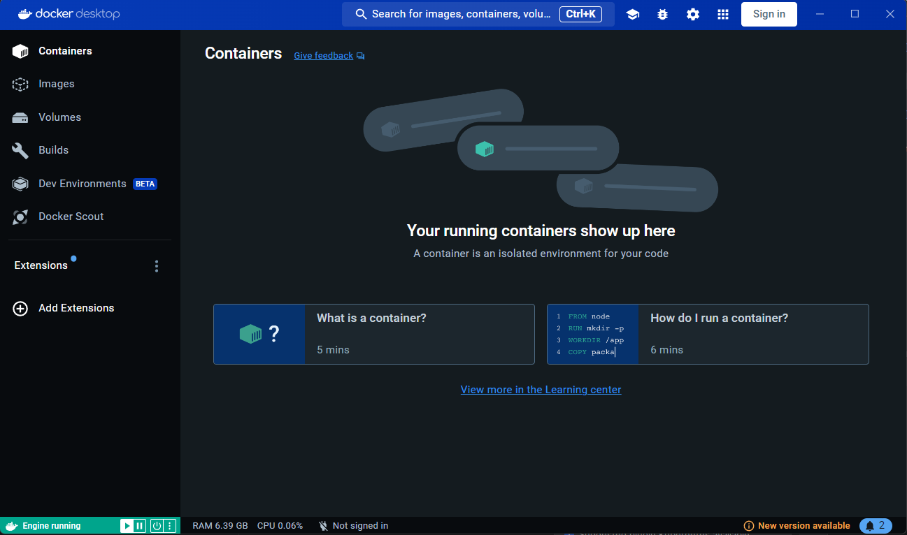

## Запуск проекта
Весь проект запускается с помощью Docker, поэтому, устанавливаем и запускаем Docker
### Запущенный Docker выглядит так

## Команды для запуска
1) Откройте терминал
2) Перейдите в папку, где лежит docker-compose.yml файл проекта
3) Вводим команды
#### Билдим проекты
```
docker-compose build
```
#### Запускаем контейнер
```
docker-compose up -d
```
#### Далее переходим по ссылкам


[Сервис авторизации](http://localhost:8080/swagger-ui/index.html)\
[Сервис для работы с задачами](http://localhost:2751/swagger-ui/index.html#/)

